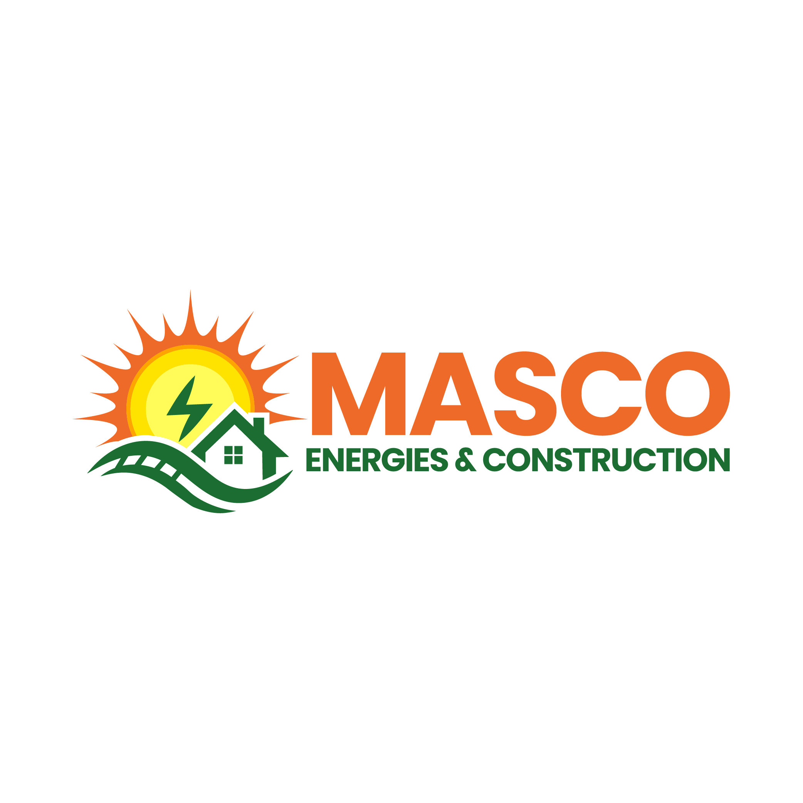

# Masco Énergie et Construction - Site Web



## 🏗️ À Propos

**Masco Énergie et Construction** est une entreprise spécialisée dans les infrastructures et la construction en République Démocratique du Congo. Ce repository contient le site web officiel de l'entreprise, développé avec Django et une interface frontend moderne.

## ✨ Fonctionnalités

- 🏠 **Page d'accueil** avec présentation de l'entreprise
- 👥 **Section équipe** avec photos des dirigeants
- 🤝 **Partenaires** avec logos des entreprises partenaires
- 📰 **Blog/Articles** avec système de gestion de contenu
- 🎥 **Galerie multimédia** avec images et vidéo de présentation
- 📱 **Design responsive** compatible mobile et desktop
- 🎨 **Système de design uniforme** avec couleurs Masco

## 🛠️ Technologies Utilisées

- **Backend:** Django 5.2.5
- **Frontend:** HTML5, CSS3, JavaScript, Tailwind CSS
- **Base de données:** SQLite
- **Fonts:** Inter (Google Fonts)
- **Icons:** Font Awesome
- **Responsive:** Design mobile-first

## 📂 Structure du Projet

```
Masco/
├── backend/Bac/myblog_project/     # Application Django
│   ├── blog/                      # App principale
│   │   ├── models.py              # Modèles (Article, Video)
│   │   ├── views.py               # Vues et API
│   │   ├── Templates/blog/        # Templates Django
│   │   └── static/blog/           # Assets optimisés
│   │       ├── css/               # Système CSS Masco
│   │       ├── images/            # 17 images essentielles
│   │       ├── images_unused/     # Archives (91 images)
│   │       └── videos/            # Vidéo de présentation
│   └── manage.py                  # Script Django
├── frontend/                      # Assets frontend originaux
└── docs/                          # Documentation
```

## 🚀 Installation et Configuration

### Prérequis
- Python 3.8+
- Django 5.2.5
- Git

### Installation

1. **Cloner le repository**
```bash
git clone <URL_REPOSITORY>
cd Masco
```

2. **Installer les dépendances**
```bash
cd backend/Bac/myblog_project
pip install django
```

3. **Migrations de la base de données**
```bash
python manage.py migrate
```

4. **Créer un superutilisateur**
```bash
python manage.py createsuperuser
```

5. **Démarrer le serveur**
```bash
python manage.py runserver
```

6. **Accéder au site**
   - Site web : http://127.0.0.1:8000/
   - Admin : http://127.0.0.1:8000/admin/

## 📋 Utilisation

### Administration
- **URL Admin :** http://127.0.0.1:8000/admin/
- **Identifiants :** admin / masco123
- **Gestion des articles** via l'interface d'administration Django

### API Endpoints
- `GET /api/articles/` - Liste des articles
- `GET /api/article/<id>/` - Détail d'un article

### Pages Principales
- `/` - Page d'accueil Masco
- `/articles/` - Liste des articles du blog
- `/article/<id>/` - Détail d'un article

## 🎨 Design System

Le projet utilise un système de design uniforme avec :
- **Couleur principale :** #1a3a5e (Bleu Masco)
- **Couleur secondaire :** #e67e22 (Orange)
- **Police :** Inter (Google Fonts)
- **CSS Variables** pour la cohérence
- **Components réutilisables**

## 👥 Équipe

- **Gabriel MADUA MASUDI** - Chairman MEC
- **Park CHANG MOOK** - Vice-Président
- **Georges KAMBA SHUTSHA** - ADG

## 🤝 Partenaires

- APCSC
- BGFI Bank
- CCCC
- CCECC
- FHEC

## 📊 Optimisations

Ce projet a été optimisé pour GitHub :
- **94% de réduction** de la taille des assets
- **17 images essentielles** conservées (4.4 MB)
- **91 images archivées** pour référence future
- **Structure claire** et documentation complète

## 📝 Changelog

### Version 1.0.0 (Sept 2025)
- ✅ Site web Masco complet
- ✅ Système de blog intégré
- ✅ Design uniforme et responsive
- ✅ Optimisation des assets
- ✅ Documentation complète

## 📄 Licence

© 2025 Masco Énergie et Construction. Tous droits réservés.

## 🆘 Support

Pour toute question ou assistance, contactez l'équipe de développement.

---
*Développé avec ❤️ pour Masco Énergie et Construction*
